<p align="center">
  
</p>

trakarr holds downloads when your ratio drops and releases them once seeding
brings it back.

Rules pick torrents by tag or tracker domain. A rule can also switch a Prowlarr
indexer's sync profile while it holds, and each tracker can count upload bought
with bonus points and freeleech windows. Only downloading torrents are ever
held: completed and stopped ones are left alone, and nothing is deleted. A fresh
install runs in test mode, which only logs what it would do.

## Install

On Debian or Ubuntu, such as a Proxmox LXC, as root:

```sh
bash -c "$(curl -fsSL https://raw.githubusercontent.com/blacktower-lab/trakarr/main/scripts/install.sh)"
```

It installs Node.js 24, the latest release in `/opt/trakarr` and a systemd
service, with settings, rules and the database in `/var/lib/trakarr`. The
dashboard is on port 7478. Run it again to update.

Then connect qBittorrent in Settings > Integrations with an API key from its
WebUI options, which needs qBittorrent 5.2 or later, add a rule, and turn test
mode off once its events look right. To be told when it holds, releases or loses
qBittorrent, add an ntfy topic in Settings > Notifications.

## Development

Needs Node.js 24 and git. Every `npm` command runs from the repository's root,
which is an npm workspace of `server/` and `app/`.

```sh
git clone https://github.com/blacktower-lab/trakarr.git
cd trakarr
npm run dev
```

`npm run dev` calls `scripts/run.sh`, which installs the dependencies if
`node_modules` is missing and starts the server and the app together. The
dashboard is on http://localhost:5173 and proxies `/api` to the server on port
7478. Ctrl-C stops both, and if one crashes the other stops too. You can also
run the script directly, from any folder.

The rest, from the root as well:

```sh
npm ci                  # install the dependencies, which run.sh does by itself
npm test                # the server's tests
npm run build           # build the app into app/dist
npm run dev -w server   # only the server, which restarts when its files change
npm run dev -w app      # only the app
```

In development, settings, rules and the database go in `config/`.

| Folder     | What's in it                                                                      |
| ---------- | --------------------------------------------------------------------------------- |
| `server/`  | The server, TypeScript that Node runs with no build                               |
| `app/`     | The dashboard: React, Vite, Tailwind and HeroUI                                   |
| `site/`    | The landing page, published to GitHub Pages                                       |
| `assets/`  | The logo and wordmark, shared by the app and the site                             |
| `scripts/` | `run.sh` for development, `package.sh` builds a release, `install.sh` installs it |
